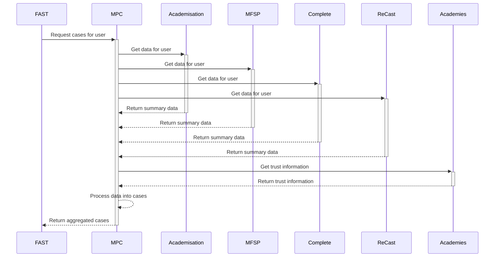

Case Aggregation Service - API
==========================================================================

API for aggregating cases to create a unified view for Delivery officers. This is used gather cases from, but not to limited to, Prepare academy conversions, Complete academy conversions, Record concerns about schools and trusts and Manage Free School Projects.

Table of Contents
-----------------

- [Case Aggregation Service - API](#case-aggregation-service---api)
  - [Table of Contents](#table-of-contents)
  - [1. System Overview](#1-system-overview)
    - [Sequence Diagram](#sequence-diagram)
  - [Error handling](#error-handling)
  - [2. Development Setup](#2-development-setup)
  - [3. Changing links](#3-changing-links)
  - [4. Adding new systems](#4-adding-new-systems)

1\. System Overview
-------------------------

The process of gathering cases involves calling multiple other api's, gathering the projects or cases that are assigned to the provided user and then process them into a format used by consumers.

The only current consumer is Find information about schools and trusts, which uses this data to render in the Manage projects and cases area.

### Sequence Diagram



## Error handling

In general this service will not return an error to the client if a system fails to return or process the result of an api call. This is so that a partial result can be returned if one system is down or erroring. If an error is raised it must still be logged for monitoring but a result will still be returned. This does not apply for system errors within the api itself only to external calls to other systems.

2\. Development Setup
-------------------------

This project should run without any setup with secrets however no data will return from the API. The quickest way enable data is to set one of the following secrets for an existing development environment. Not all of these need to be set just the system that you wish to receive data from.

```
 "AcademisationApiClient:ApiKey"
 "RecastApiClient:ApiKey"
 "AcademiesApiClient:ApiKey"
 "MfspApiClient:ApiKey"
 "CompleteApiClient:ClientSecret"
```

If you do not have access to these environments you can run a local version of the system(s) you wish to retrieve data from and set the secrets for them. Each system will have different settings so see the [appsettings.json](.\src\Dfe.CaseAggregationService.Api\appsettings.json) for further details

For authentication to the system you will need to request a client secret for the Case Api. You will need to call the API with a valid bearer token which can be acquired via http request or using a tool like Postman.

Otherwise if not using DfE system you will need to set up your own authentication and update your settings to reflect this.

3\. Changing links
-------------------------

One of the most probable issues with the system is that link will become stale or broken over time and need updating. 

There are two sets of links:

System links - the link that allows a user to directly access a case. This will be different for all, this is under the app configuration: ```"SystemLinks"``` this will needed to be done on a environment by environment level. 

Guidance and Resource links - these links provide internal links to guidance and resources based on a per system level. This is the same between all environment so updating at the root settings files. This is under ```"GuidanceLookup"``` and ```"ResourcesLookup"``` with a key under for each System and Type of Case. When changing this 


4\. Adding new systems
-------------------------

To add a new system the minimum required is to implement the `ISystemIntegration` interface. This will automatically be executed when an API call is made. Within the implementation the query from the api is directly accessible from the call.

There is a wrapper that also assists in executing the integration, where ```ProcessRequest``` handles the mapping of the data and prevents propagation of errors

```csharp
public record NewSummary(int Id, string SomeData);

public class NewIntegration
(IGetCaseInfo<NewSummary> mapper,
    ILogger<NewIntegration> logger)
    : IntegrationWrapper<NewSummary>(mapper, logger), ISystemIntegration
{
    public Task<IEnumerable<UserCaseInfo>> GetCasesForQuery(GetCasesForUserQuery query, CancellationToken cancellationToken)
    {
        return Task.FromResult<IEnumerable<NewSummary>>
            ([new NewSummary(1, "data")]) 
            .ContinueWith(ProcessResult, cancellationToken);
    }

}
```
